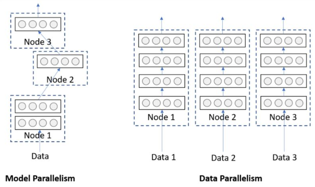
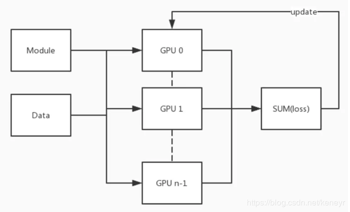

# DDP
# PyTorch分布式训练

目前分布式训练的方法中主要分为数据并行与模型并行两种方法，其中在大多实验中以数据并行为主。模型并行主要存在于工业应用中，一般模型较大、训练数据是学术实验中训练数据的几何倍数。


## 数据并行

PyTorch中实现数据并行的方法主要有DataParallel 和distributed 两种方法。

### DataParallel 

```python
torch.nn.DataParallel(Module)
```

DataParallel可以实现数据的并行训练，默认会按照设定的batch size将数据平均分配到每个GPU上，假设在工作站A上共有4张GPU，设定batch size=32，此时每张卡上将会获得 size=32/4 =8 的数据量。

在前向传播中每张卡将分别计算前向传播的参数，在反向传播过程中会将梯度汇集到一张卡上计算其梯度下降。一般会将数据汇集到原始GPU中，因此会产生GPU负载不均衡的问题，常常会出现第一张卡会满负载而其他卡利用率仅为一半的情况。

盗张图 [原图](https://www.jianshu.com/p/9e36e5e36638?utm_source=oschina-app)



DataParallel(Module) [官方文档](https://pytorch.org/docs/1.0.0/nn.html?highlight=dataparallel#torch.nn.DataParallel ) [官方示例](https://pytorch.org/tutorials/beginner/former_torchies/parallelism_tutorial.html?highlight=dataparallel)

```
This container parallelizes the application of the given :attr:`module` bysplitting the input across the specified devices by chunking in the batchdimension (other objects will be copied once per device). In the forwardpass, the module is replicated on each device, and each replica handles aportion of the input. During the backwards pass, gradients from each replicaare summed into the original module.
```

实现方法

```python
import torch.nn as nn
model = Net()
# 可直接指定需要使用GPU编号
model = nn.DataParalle(model.cuda(), device_ids=[0, 1, 2, 3])
# 或者使用CUDA_VISIBLE_DEVICES指定
# os.environ['CUDA_VISIBLE_DEVICES'] = '0,1,2,3'
# model = nn.DataParallel(model).cuda()
```

```python
for batch_idx, (imgs, ids) in enumerate(trainloader):
    # 数据也要由内存转到GPU内存中
    imgs, ids = imgs.cuda(), ids.cuda()
    feature = model(imgs)
    loss = criterion_xent(feature, ids)
    optimizer.zero_grad()
    loss.backward()
    optimizer.step()
```

该使用方法在GPUs<8时效果较好，在GPU数据较多时官方推荐使用多进程（multiprocessing）实现

### distributed 

多机（节点）多卡训练 [官方函数说明](https://pytorch.org/docs/stable/distributed.html?highlight=distribut#module-torch.distributed) [官方教程]( https://pytorch.org/tutorials/intermediate/ddp_tutorial.html)

ImageNet数据集是一个里程碑式的数据集，很多模型都是此数据集上进行预训练然后进行到其他数据集进行训练。如何更快的使用此数据集训练模型，推荐阅读腾讯的[4分钟训练ImageNet](https://blog.csdn.net/Tencent_TEG/article/details/81295158)

在感叹腾讯的实力（GPU数量不是一般小实验室搞得起的，技术很强）之余，使用PyTorch在mnist数据集上进行小试牛刀。mnist在练习使用PyTorch时很有帮助，但在此处使用多机多卡进行训练时可能还不如单张卡。其主要原为mnist数据集本身很小，其训练时间短，多机多卡训练需要对数据进行划分并复制到不同的GPU上，划分所需的时间可能比真正训练的时间长。因此想要体现出多机多卡的优势请选择较大的模型和数据集，并将Batch size设置的大一些。

distributed 数据并行的几个细节

#### 1、distribute的实现需要与多进行搭配

```python
import torch.multiprocessing as mp
mp.spawn(main_worker, nprocs=ngpus_per_node, args=(ngpus_per_node, args))
# main_worker 是训练的具体函数，下面将进行介绍 
# nprocs 每个节点上GPU的个数
```

#### 2、模型复制

```python
import torch
model = torch.nn.parallel.DistributedDataParallel(model, device_ids=[args.gpu])
# 使用 DistributedDataParallel 函数将模型复制到GPU中
```

#### 3、数据划分

```python
train_dataset = datasets.MNIST('data', train=True, download=True,
                                   transform=transforms.Compose([
                                       transforms.ToTensor(),
                                       transforms.Normalize((0.1307,), (0.3081,))
                                   ]))
if args.distributed:
    train_sampler = torch.utils.data.distributed.DistributedSampler(train_dataset)
    # 使用DistributedSampler对数据集进行划分，例如batch size = 100，GPU=4，每张卡将分配到batch size = 25，此方法使用平均划分的方法，如有个性化需求需要自行实现数据划分
else:
    train_sampler = None

train_loader = torch.utils.data.DataLoader(
    train_dataset, batch_size=args.batch_size, shuffle=(train_sampler is None),
    num_workers=args.workers, pin_memory=True, sampler=train_sampler)

# train_sampler 为选取器，从train_dataset中按照train_sampler规则进行选取
```

完整代码请看mnist_train.py，此代码根据[官方示例](https://github.com/pytorch/examples/tree/master/imagenet)改写，启动方式与官方示例的方式相同

Github代码示例

官方示例1：https://github.com/seba-1511/dist_tuto.pth

官方示例2：https://github.com/pytorch/examples/tree/master/imagenet

https://github.com/yangkky/distributed_tutorial

其他介绍：

https://blog.csdn.net/zwqjoy/article/details/89415933

https://blog.csdn.net/m0_38008956/article/details/86559432

https://zhuanlan.zhihu.com/p/68717029

https://zhuanlan.zhihu.com/p/38949622

https://blog.csdn.net/u010557442/article/details/79431520

## 模型并行

[官方示例](https://pytorch.org/tutorials/intermediate/model_parallel_tutorial.html)

基本用法

```python
import torch
import torch.nn as nn
import torch.optim as optim


class ToyModel(nn.Module):
    def __init__(self):
        super(ToyModel, self).__init__()
        # 将net1复制到GPU0上进行计算
        self.net1 = torch.nn.Linear(10, 10).to('cuda:0')
        self.relu = torch.nn.ReLU()
        # 将net2复制到GPU1上进行计算
        self.net2 = torch.nn.Linear(10, 5).to('cuda:1')

    def forward(self, x):
        x = self.relu(self.net1(x.to('cuda:0')))
        return self.net2(x.to('cuda:1'))
    
model = ToyModel()
loss_fn = nn.MSELoss()
optimizer = optim.SGD(model.parameters(), lr=0.001)

optimizer.zero_grad()
outputs = model(torch.randn(20, 10))
labels = torch.randn(20, 5).to('cuda:1')
loss_fn(outputs, labels).backward()
optimizer.step()
```

上述代码中的net1和net1既可以简单的一层网络也可以是nn.Sequential生成的网络片段。这种基本方法会将输入数据先在GPU0上进行训练，然后在转移到GPU1上进行训练，可以发现，无论何时都只有一张卡在计算而另一张卡在等待。为解决此问题，PyTorch提供了Pipelining Inputs（流水线）的方法实现模型并行。

假设Batch size = 120。按照split_size=20对batch size进行进一步划分。当PyTorch异步启动CUDA操作时，该实现无需生成多个线程即可实现并发。

```python
class PipelineParallelResNet50(ModelParallelResNet50):
    def __init__(self, split_size=20, *args, **kwargs):
        super(PipelineParallelResNet50, self).__init__(*args, **kwargs)
        self.split_size = split_size

    def forward(self, x):
        splits = iter(x.split(self.split_size, dim=0))
        s_next = next(splits)
        s_prev = self.seq1(s_next).to('cuda:1')
        ret = []

        for s_next in splits:
            # A. s_prev runs on cuda:1
            s_prev = self.seq2(s_prev)
            ret.append(self.fc(s_prev.view(s_prev.size(0), -1)))

            # B. s_next runs on cuda:0, which can run concurrently with A
            s_prev = self.seq1(s_next).to('cuda:1')

        s_prev = self.seq2(s_prev)
        ret.append(self.fc(s_prev.view(s_prev.size(0), -1)))

        return torch.cat(ret)
```


